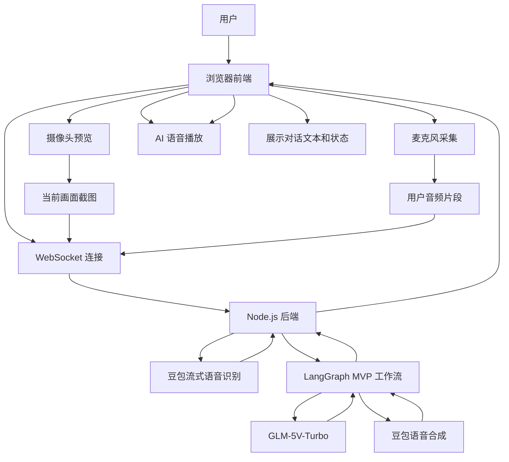
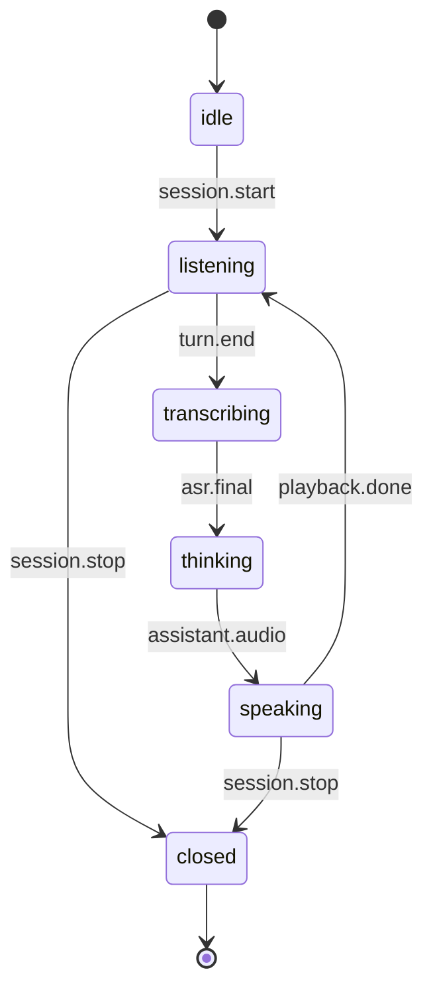
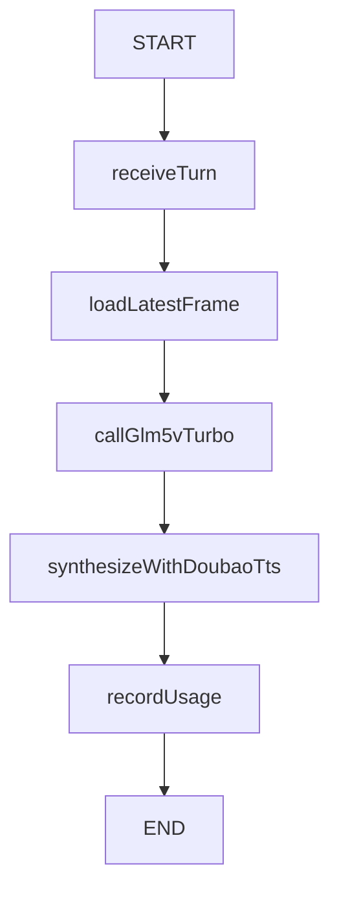
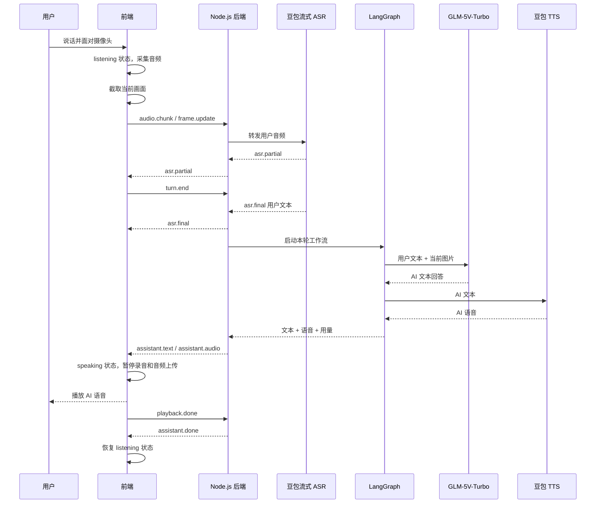

# AI 视觉对话助手 MVP 开发文档

## 1. 目标

本 MVP 用于打通 AI 视觉对话助手的最小闭环：

用户打开浏览器后，授权摄像头和麦克风。前端采集用户语音和当前摄像头画面，将数据发送到 Node.js 后端。后端使用豆包流式语音识别将用户语音转为文本，使用 LangGraph 编排最小 AI 工作流，调用 GLM-5V-Turbo 结合文本和图片生成回答，再使用豆包语音合成模型将 AI 文本转为语音，最后返回前端播放。

MVP 采用半双工语音交互：用户说话时系统录音并识别；AI 回复时前端暂停录音和音频上传；AI 播放完成后前端恢复录音。MVP 阶段不支持用户打断 AI。

## 2. 项目架构

本项目采用 **monorepo** 架构，由 pnpm workspace 统一管理。

```
AI-MutiModal-Assistant/
├── pnpm-workspace.yaml          # workspace 定义
├── package.json                 # 根脚本：dev / build / lint
├── tsconfig.base.json           # 公共 TS 配置
├── docker-compose.yml           # Docker 编排
├── Dockerfile.frontend          # 前端容器镜像
├── Dockerfile.backend           # 后端容器镜像
├── .env.example                 # 环境变量模板
├── packages/
│   ├── frontend/                # React + Vite + TypeScript
│   └── backend/                 # Express + TypeScript
└── spec/
    └── MVP开发文档.md
```

### 包管理

| 命令 | 说明 |
|---|---|
| `pnpm dev` | 同时启动前后端开发服务器 |
| `pnpm dev:frontend` | 单独启动前端（localhost:5173） |
| `pnpm dev:backend` | 单独启动后端（localhost:3001） |
| `pnpm build` | 构建所有包 |
| `pnpm lint` | 类型检查所有包 |

### Docker 部署

`docker compose up -d` 启动三个服务：

- **frontend**：Nginx 容器，代理前端构建产物，端口 5173
- **backend**：Node.js 容器，运行 Express 应用，端口 3001
- **postgres**：PostgreSQL 16 数据库，端口 5432（MVP 阶段未启用）

## 3. MVP 功能范围

本阶段实现以下能力：

| 功能 | 说明 |
|---|---|
| 摄像头预览 | 前端打开摄像头并显示本地视频 |
| 麦克风采集 | 前端打开麦克风并采集用户语音 |
| 音频上传 | 前端通过 WebSocket 将用户音频片段发送给后端 |
| 半双工控制 | AI 播放期间前端暂停录音和音频上传 |
| 画面截图 | 前端从摄像头视频中截取当前画面 |
| 图片上传 | 前端将压缩后的图片发送给后端 |
| 语音识别 | 后端调用豆包流式语音识别，将用户语音转为文本 |
| AI 工作流 | 后端用 LangGraph 编排最小对话流程 |
| 多模态理解 | 后端调用 GLM-5V-Turbo，输入用户文本和当前图片 |
| 语音合成 | 后端调用豆包语音合成模型，将 AI 文本回答转为语音 |
| 前端播放 | 前端播放 AI 语音，并展示用户文本和 AI 文本 |
| 用量记录 | 后端记录本次音频时长、图片次数、模型调用次数 |

## 4. 不在 MVP 范围内

| 功能 | 说明 |
|---|---|
| 用户账号系统 | MVP 使用匿名 session |
| 数据库持久化 | MVP 可使用内存保存会话状态（PostgreSQL 已就绪） |
| 长期记忆 | 不跨会话保存用户信息 |
| 连续视频理解 | 不上传完整视频流 |
| 高级帧差检测 | MVP 只保留最近一张截图 |
| 多 Agent 协作 | 只使用一个最小 LangGraph 工作流 |
| 复杂成本面板 | 只记录基础调用次数 |
| 生产级监控 | 只输出基础日志 |
| 复杂权限系统 | 只保留服务端 API Key |
| 用户打断 AI | MVP 阶段 AI 说话时不接收用户插话 |
| 电话级全双工 | MVP 采用半双工，不同时录音和播放 |

## 5. 外部服务

| 服务 | 用途 | 文档 |
|---|---|---|
| 豆包流式语音识别 | 将用户实时音频转为文本 | https://www.volcengine.com/docs/6561/1354869?lang=zh |
| 豆包语音合成模型 | 将 AI 文本回答转为语音 | https://www.volcengine.com/docs/6561/1329505?lang=zh |
| GLM-5V-Turbo | 根据用户文本和摄像头图片生成多模态回答 | 按项目环境配置 |

## 6. 总体架构



## 7. 半双工语音状态机

MVP 使用半双工状态机控制前端录音、后端识别和 AI 播放。



| 状态 | 前端行为 | 后端行为 |
|---|---|---|
| idle | 等待用户开始 | 无活跃会话 |
| listening | 采集麦克风音频并发送 `audio.chunk` | 接收音频并转发豆包流式 ASR |
| transcribing | 暂停本轮录音，等待识别结果 | 收集 ASR final 文本 |
| thinking | 不发送音频，显示思考中 | 运行 LangGraph，调用 GLM-5V-Turbo |
| speaking | 播放 AI 语音，暂停录音和音频上传 | 下发 AI 文本和音频，忽略新的 `audio.chunk` |
| closed | 释放摄像头、麦克风和连接 | 清理 session 内存状态 |

AI 回复期间，前端不向后端发送用户音频。后端也需要基于 session 状态做兜底：当 session 处于 `speaking` 时，直接丢弃或忽略收到的 `audio.chunk`，防止 AI 播放声进入 ASR。

## 8. 前端架构

前端使用 React + TypeScript 实现，Vite 6 作为构建工具。

### 8.1 前端模块

| 模块 | 职责 |
|---|---|
| Media Permission | 请求摄像头和麦克风权限 |
| Camera Preview | 显示本地摄像头视频 |
| Audio Recorder | 在 `listening` 状态采集用户语音并发送音频片段 |
| Half Duplex Controller | 控制 `listening`、`thinking`、`speaking` 等状态 |
| Frame Capture | 从视频中截取当前画面 |
| Realtime Client | 通过 WebSocket 与后端通信 |
| Conversation UI | 展示用户转写文本和 AI 回复文本 |
| Audio Player | 播放后端返回的 AI 语音 |
| Status UI | 展示连接中、聆听中、识别中、思考中、播放中等状态 |

### 8.2 前端最小流程

```text
用户点击开始
-> 请求摄像头和麦克风权限
-> 显示摄像头预览
-> 建立 WebSocket 连接
-> 进入 listening 状态
-> 采集并发送用户音频
-> 截取当前摄像头画面并上传
-> 用户本轮说话结束，发送 turn.end
-> 进入 transcribing / thinking 状态
-> 接收用户文本、AI 文本、AI 音频
-> 进入 speaking 状态，暂停录音和音频上传
-> 播放 AI 语音
-> 播放完成后发送 playback.done
-> 恢复 listening 状态
```

## 9. 后端架构

后端使用 Express 5 + TypeScript 实现，负责实时连接、豆包 ASR/TTS 调用、GLM-5V-Turbo 调用、LangGraph 工作流编排和基础用量记录。DB 使用 PostgreSQL（Docker），MVP 阶段暂不启用。

### 9.1 后端模块

| 模块 | 职责 |
|---|---|
| WebSocket Gateway | 接收前端音频、图片和控制事件 |
| Session Manager | 管理当前会话状态和半双工状态 |
| Doubao ASR Service | 对接豆包流式语音识别 |
| Frame Store | 保存当前会话最近一张图片 |
| LangGraph Workflow | 编排一次 AI 回复流程 |
| GLM Service | 调用 GLM-5V-Turbo 进行多模态理解 |
| Doubao TTS Service | 调用豆包语音合成模型 |
| Usage Recorder | 记录本次调用的基础用量 |

### 9.2 后端最小流程

```text
接收前端 audio.chunk
-> 当前 session 为 listening 时转发给豆包流式 ASR
-> 收到 turn.end 后结束本轮识别
-> 获取 ASR final 用户文本
-> 读取当前 session 最近一张摄像头图片
-> 进入 LangGraph 工作流
-> 调用 GLM-5V-Turbo 生成文本回答
-> 调用豆包 TTS 生成语音
-> 将 session 状态切为 speaking
-> 返回用户文本、AI 文本、AI 音频给前端
-> 等待前端 playback.done
-> 将 session 状态切回 listening
-> 记录基础用量
```

## 10. LangGraph MVP 工作流

MVP 中 LangGraph 处理一条固定链路，不做复杂分支。



### 10.1 工作流节点

| 节点 | 输入 | 输出 | 职责 |
|---|---|---|---|
| receiveTurn | sessionId、用户文本、图片 | 标准化输入 | 整理本轮请求数据 |
| loadLatestFrame | 图片或 frameId | 当前图片 | 读取最近一张画面 |
| callGlm5vTurbo | 用户文本、图片 | AI 文本 | 调用 GLM-5V-Turbo |
| synthesizeWithDoubaoTts | AI 文本 | AI 音频 | 调用豆包 TTS |
| recordUsage | 本轮调用信息 | usage | 记录基础用量 |

ASR 在 WebSocket Gateway 和 Doubao ASR Service 中处理。LangGraph 接收的是 ASR final 后的用户文本。

### 10.2 MVP 状态

```text
sessionId
sessionState
latestImage
userText
assistantText
assistantAudio
usage
error
```

## 11. 实时通信协议

MVP 使用一个 WebSocket 连接传输前后端事件。

### 11.1 前端发送事件

| 事件 | 说明 |
|---|---|
| session.start | 开始会话 |
| audio.chunk | 上传用户音频片段，仅在 `listening` 状态发送 |
| frame.update | 上传当前摄像头截图 |
| turn.end | 表示用户本轮说话结束 |
| playback.done | 表示 AI 语音播放完成，允许恢复录音 |
| session.stop | 结束会话 |

### 11.2 后端返回事件

| 事件 | 说明 |
|---|---|
| session.ready | 会话已准备 |
| asr.partial | 豆包流式 ASR 临时识别结果，可用于前端展示 |
| asr.final | 用户语音识别最终结果 |
| assistant.thinking | AI 工作流处理中 |
| assistant.text | AI 文本回答 |
| assistant.audio | AI 语音结果 |
| assistant.done | 本轮 AI 回复已完成 |
| usage.update | 本轮基础用量 |
| error | 错误信息 |

## 12. 单轮对话时序



## 13. 视觉处理方式

MVP 不做连续视频理解，只处理最近一张截图。

| 项目 | MVP 规则 |
|---|---|
| 截图时机 | 用户开始一轮提问时截取，或本轮 `turn.end` 前保留最近画面 |
| 图片数量 | 每轮最多 1 张 |
| 图片处理 | 前端压缩后上传 |
| 图片保存 | 后端只保存当前 session 最近一张 |
| 图片用途 | 与用户文本一起传给 GLM-5V-Turbo |
| 图片生命周期 | 会话结束后清理 |

## 14. 语音处理方式

MVP 采用半双工短句式实时链路。

```text
前端 listening 状态采集用户语音
-> WebSocket 上传 audio.chunk
-> 后端转发豆包流式 ASR
-> 得到用户文本
-> GLM-5V-Turbo 生成回答
-> 豆包 TTS 合成语音
-> 前端 speaking 状态播放
-> 播放完成后恢复 listening 状态
```

MVP 不实现完整电话级全双工体验。用户一轮说完后，系统处理并播放 AI 回答。AI 播放期间，前端暂停录音和音频上传；后端也不处理新的用户音频。

## 15. 成本控制

MVP 采用基础成本控制。

| 控制点 | MVP 做法 |
|---|---|
| 视频成本 | 不上传连续视频 |
| 图片成本 | 每轮最多上传 1 张图片 |
| 图片大小 | 前端压缩后上传 |
| ASR 成本 | 只在 `listening` 状态向豆包 ASR 发送用户音频 |
| 模型成本 | 每轮只调用一次 GLM-5V-Turbo |
| TTS 成本 | 只对最终回答调用一次豆包 TTS |
| AI 播放期间成本 | 前端暂停录音，后端忽略 `speaking` 状态下的新音频 |
| 会话成本 | 记录每轮 ASR、GLM、TTS 调用次数 |

## 16. 错误处理

| 错误 | 处理 |
|---|---|
| 用户拒绝摄像头权限 | 前端提示无法看到画面 |
| 用户拒绝麦克风权限 | 前端提示无法语音对话 |
| WebSocket 断开 | 前端显示连接失败 |
| 豆包 ASR 失败 | 返回"没有听清，请再说一次" |
| 图片缺失 | 仅根据用户文本回答 |
| GLM 调用失败 | 返回 AI 服务暂不可用 |
| 豆包 TTS 失败 | 前端只展示文本回答 |
| playback.done 未收到 | 超时后后端将 session 恢复到 listening 或结束会话 |

## 17. 安全边界

| 边界 | 说明 |
|---|---|
| API Key | 豆包、GLM 等密钥只保存在后端环境变量中 |
| 前端 | 不直接调用豆包 ASR、豆包 TTS 或 GLM-5V-Turbo |
| 音频 | MVP 不持久化原始音频 |
| 图片 | MVP 不持久化原始图片 |
| 会话 | 使用匿名 sessionId |
| 日志 | 只记录必要状态和错误信息 |

## 18. 验收标准

MVP 完成后需要满足以下标准：

| 编号 | 标准 |
|---|---|
| 1 | 前端可以打开摄像头并显示本地预览 |
| 2 | 前端可以打开麦克风并采集用户语音 |
| 3 | 前端可以建立 WebSocket 连接 |
| 4 | 前端可以在 `listening` 状态上传音频片段 |
| 5 | 前端可以上传当前摄像头截图 |
| 6 | 后端可以通过豆包流式 ASR 将音频转为用户文本 |
| 7 | 后端可以将用户文本和图片传入 LangGraph 工作流 |
| 8 | LangGraph 可以调用 GLM-5V-Turbo 生成文本回答 |
| 9 | 后端可以通过豆包 TTS 将 AI 文本转为语音 |
| 10 | 前端可以展示用户文本和 AI 文本 |
| 11 | 前端可以播放 AI 语音 |
| 12 | AI 语音播放期间前端暂停录音和音频上传 |
| 13 | AI 语音播放完成后前端发送 `playback.done` 并恢复录音 |
| 14 | 后端在 `speaking` 状态下不处理新的 `audio.chunk` |
| 15 | 会话结束后前端释放摄像头和麦克风 |
| 16 | 后端不向前端暴露豆包或 GLM API Key |
| 17 | 每轮调用有基础用量记录 |

## 19. MVP 链路总结

MVP 链路如下：

```text
浏览器摄像头 + 麦克风
-> 前端 listening 状态上传音频和当前截图
-> Node.js 后端接收
-> 豆包流式 ASR 转文字
-> LangGraph 编排
-> GLM-5V-Turbo 多模态回答
-> 豆包 TTS 合成语音
-> 前端 speaking 状态暂停录音并播放语音
-> 播放完成后恢复 listening 状态
```

该链路完成后，系统具备最小可演示能力：用户可以通过语音提问，AI 可以结合摄像头当前画面进行回答，并以语音形式返回。AI 回复期间系统暂停用户录音，避免 AI 播放声被再次识别。